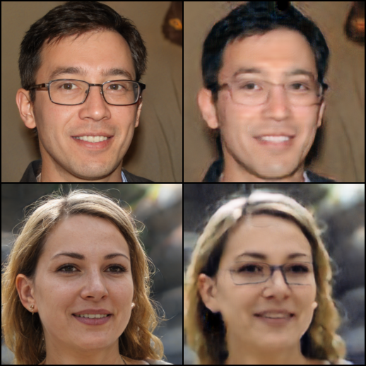
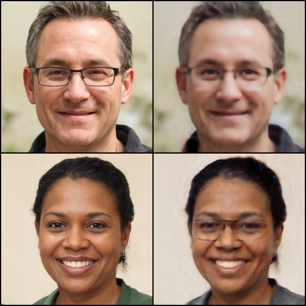
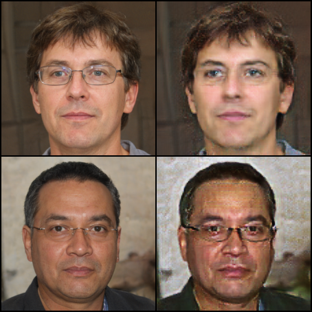
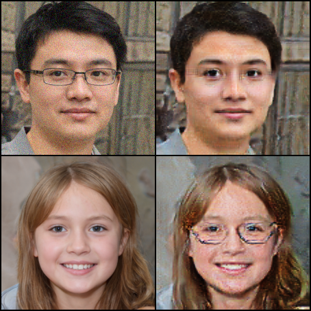

# CycleGAN for eye glasses removal or addition, implemented in PyTorch

Based on the Kaggle's project [Glasses or No Glasses](https://www.kaggle.com/datasets/jeffheaton/glasses-or-no-glasses), and [a solution](https://www.kaggle.com/code/yashikajain/eye-glass-removal).

# The task

The dataset contains 2855 faces with glasses, and 1645 without. All face images are 1024x1024 color
images, with faces aligned up, but **not paired**.

The task is to create a model to remove the eye glasses when there is a pair, and add
one when there is not.

# Dependencies

+ PyTorch (developed in 1.11.0)
+ torchvision (developed in 0.12.0)
+ Pandas (developed in 1.4.2)

# About the model

There are 2 CycleGAN models, both modified from a [CycleGAN implementation](https://www.kaggle.com/code/yashikajain/eye-glass-removal):

1. `model.py`: closer to the original version.
2. `model2.py`: more modifications on top of `model.py`. Note that this doesn't seem to perform any
better than `model.py`.

## In the `model.py` implementation

The generator has:

+ an encoder that down-samples the image by a factor of 2 in each step,
+ a few residual blocks,
+ a decoder that up-samples to restore original dimension.

The decoder uses upsample + conv instead of transposed convolution to avoid checkerboard artifacts.

The discriminator has:
+ a few convolution layers
+ sigmoid activation at the end

The CycleGAN model loss function consists of:

1. generator loss (MSE)
2. discriminator loss (MSE)
3. cycle consistency loss (L1)
4. identity loss (L1)

Each training iteration trains:

1. the discriminator a few times (could be 1, controlled by a hyperparameter).
2. the generator, optionally in a progressive manner (freeze all decoder layers, and gradually un-freeze from the beginning to end layers, then repeat again).
3. when training the generator, compute the cycle consistency loss with a certain probability (default to 0.9, so 90 % of the time a cycle-loss is computed). Similarly, compute the identity loss with a p=0.1 chance. This has no further reason other than saving some computations (maybe also an unvalidated assumption
that identity loss only serves to prevent a degenerate case where the generator pair creates nothing
but the color-inverted version of their respective inputs).

## In the `model2.py` implementation

Differences from `model.py`:

1. Tried **Switchable normalization** to replace instance normalization for the residual blocks and the decoder.
2. Add dropout to the generator.
3. Use multiple discriminators at different scales. Max-pool the input to 3 scales, and apply the same discriminator module to the 3 scales, then combine the sigmoid activations by concatenation.
4. Use RMSprop instead of Adam optimizer.

# Results

These are 2 random outputs from `model.py`, after 10 epochs:

These are 2 random outputs from `model2.py`, after 10 epochs:

In a word, pretty bad.

If you know how to improve the model please fire an issue. Thanks!
